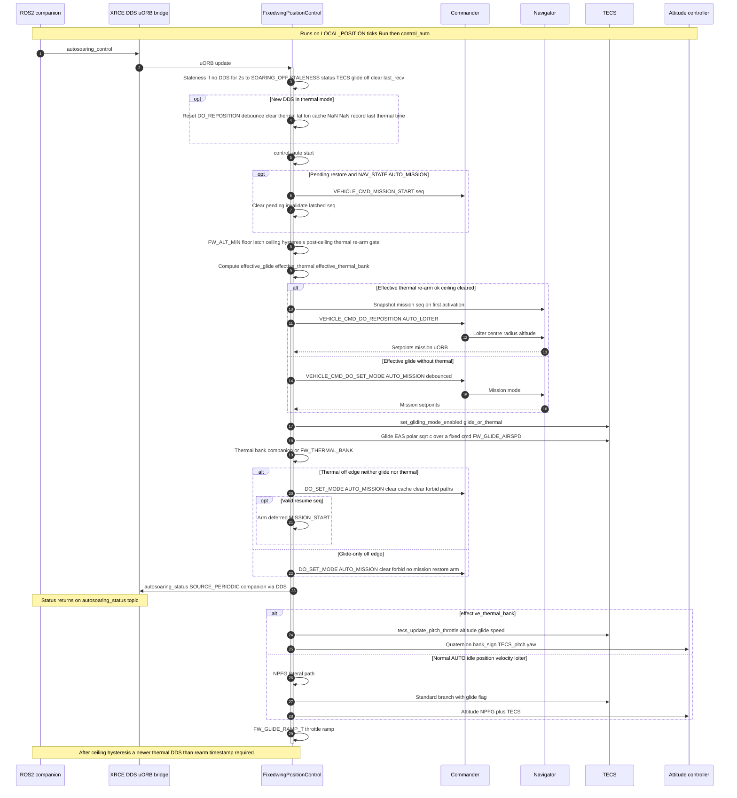
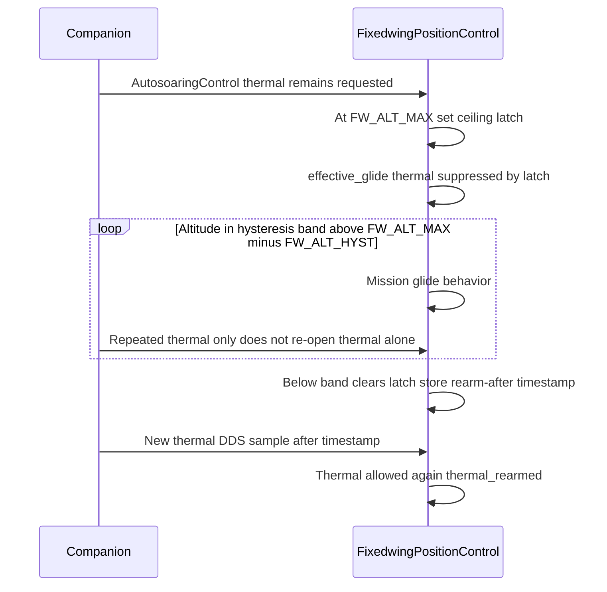

# HySoar — system sequence diagrams (Mermaid)

These diagrams summarize the XRCE-DDS autosoaring path: `FixedwingPositionControl::Run()` (ingress + staleness), `FixedwingPositionControl::control_auto()` (safety gates, Commander/Navigator, TECS, mission restore, throttle ramp), and the companion link.

Render with [Mermaid Live Editor](https://mermaid.live), VS Code **Mermaid** preview, GitHub/GitLab Markdown, or:

```bash
npx @mermaid-js/mermaid-cli -i docs/hysoar/hysoar_system_sequence.mmd -o hysoar_system_sequence.svg
npx @mermaid-js/mermaid-cli -i docs/hysoar/hysoar_ceiling_rearm_sequence.mmd -o hysoar_ceiling_rearm_sequence.svg
```

---

## 1. End-to-end HySoar flow



---

## 2. Ceiling, hysteresis, and thermal re-arm



---

## Standalone `.mmd` files (CLI / imports)

| File | Content |
|------|---------|
| `hysoar_system_sequence.mmd` | Diagram 1 (full system) |
| `hysoar_ceiling_rearm_sequence.mmd` | Diagram 2 (ceiling + re-arm) |
